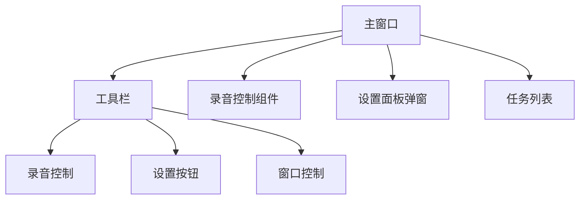
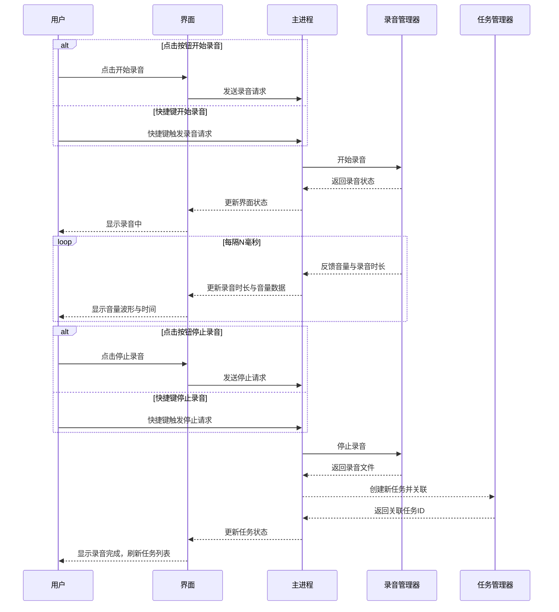
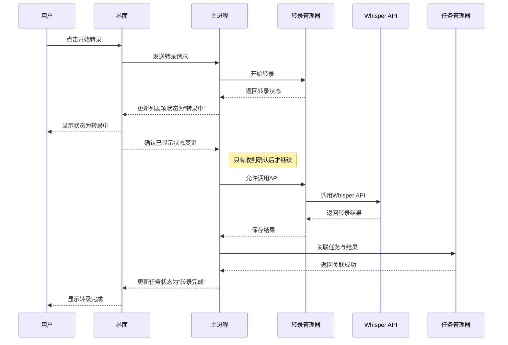
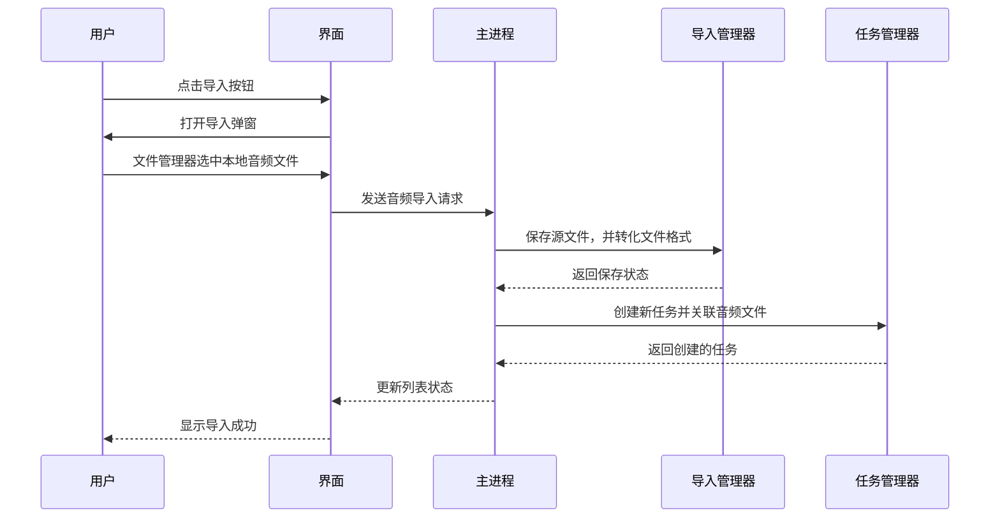
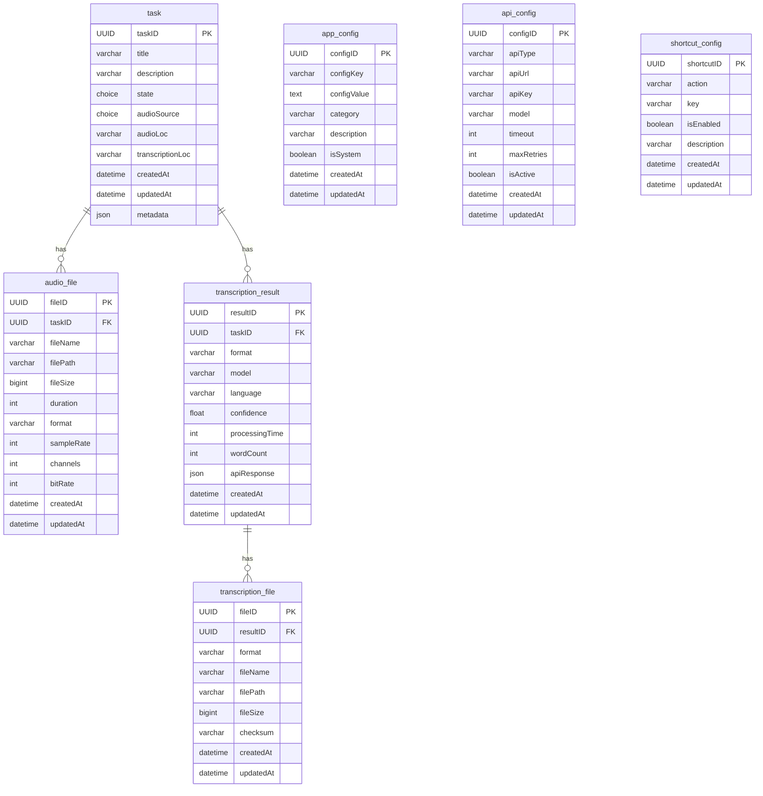

# WhisperElectron 产品需求文档 (PRD)


## 1. 项目概览

### 1.1. 产品名称
WhisperElectron - 智能语音转录桌面应用

### 1.2. 产品简介
WhisperElectron是一款基于React+Electron的跨平台桌面应用，提供高效、便捷的音频录制和语音转录服务。产品集成了OpenAI Whisper API和其他API，支持实时录音、文件导入、自动转录等功能，为用户提供完整的语音处理解决方案。

### 1.3. 核心价值

- **高效录制**: 支持全局快捷键，随时随地开始录音
- **智能转录**: 基于Whisper API的高质量语音转文本
- **统一管理**: 集中管理所有录音和转录任务
- **本地存储**: 数据完全本地化，保护用户隐私
- **跨平台**: 支持Windows、macOS平台（暂时不考虑Linus）

### 1.4. 产品定位

#### 1.4.1. 目标用户

- **内容创作者**: 需要快速记录灵感和想法的创作者
- **商务人士**: 需要会议记录和语音备忘的专业人士
- **学生群体**: 需要课程记录和学习笔记的学生
- **开发者**: 需要语音转录功能的技术人员

#### 1.4.2. 使用场景

* 会议记录和总结
- 语音备忘录创建
- 音频文件批量转录
- 学习笔记整理
- 内容创作素材收集

## 2. 功能需求

### 2.1. 音频录制功能

#### 2.1.1. 实时录音

- **全局快捷键录音**: 支持自定义快捷键在任何场景下开始录音
- **高质量录制**: 支持多种音频格式（WAV、MP3）和采样率
- **实时状态显示**: 录音过程中显示时长、音量等信息
- **设备选择**: 支持选择不同的录音设备

#### 2.1.2. 录音控制

- **开始/停止/取消**: 完整的录音控制流程
- **暂停/恢复**: 支持录音过程中的暂停和恢复
- **音量监控**: 实时显示录音音量大小
- ~~**静音检测**: 自动检测静音段落并提醒~~

### 2.2. 音频文件导入功能

#### 2.2.1. 音频文件导入

- **多格式支持**: 支持MP3、WAV、M4A、FLAC等主流音频格式
- **批量导入**: 支持一次性导入多个音频文件
- **文件验证**: 自动检查文件格式和大小限制
- **预览功能**: 导入前可预览音频文件基本信息

#### 2.2.2. 文件管理

- **文件组织**: 按日期、类型、标签等方式组织文件
- **重命名**: 支持文件和任务的重命名
- **删除管理**: 支持删除不需要的文件和任务

### 2.3. 语音转录功能

#### 2.3.1. 转录处理

- **自动转录**: 录音完成后自动开始转录
- **手动转录**: 支持手动触发转录任务
- **批量转录**: 支持批量处理多个音频文件

#### 2.3.2. 转录配置

- **API  接口**: 支持whisper官方接口和私有部署的定制化API接口
- **模型选择**: 支持多种Whisper模型（tiny、base、small、medium、large）
- **语言设置**: 支持指定语言或自动检测
- **输出格式**: 支持多种输出格式（TXT、JSON、SRT、VTT）
- **质量控制**: 可配置转录质量参数

### 2.4. 任务管理功能

#### 2.4.1. 任务列表

- **任务状态**: 清晰显示每个任务的状态（待处理、进行中、已完成、失败）
- **任务详情**: 显示任务的详细信息和进度
- ~~**状态筛选**: 支持按状态筛选任务~~
- **搜索功能**: 支持按名称、标签等搜索任务

#### 2.4.2. 任务操作

- **任务编辑**: 支持编辑任务名称、描述、标签
- **任务删除**: 支持删除不需要的任务
- **任务重试**: 支持重新执行失败的任务
- **任务导出**: 支持导出转录结果

### 2.5. 系统集成功能

#### 2.5.1. 系统托盘

- **托盘图标**: 显示应用状态的托盘图标
- **快捷菜单**: 提供常用操作的快捷菜单
- **状态指示**: 通过图标颜色显示录音状态

#### 2.5.2. 全局快捷键

- **自定义快捷键**: 支持自定义各种操作的快捷键
- **快捷键冲突检测**: 自动检测和提醒快捷键冲突
- **快捷键禁用**: 支持临时禁用快捷键

### 2.6. 设置与配置

#### 2.6.1. 音频设置
- **设备配置**: 录音设备选择和配置
- **音频参数**: 采样率、声道、格式等参数设置
- **音频测试**: 录音设备测试功能

#### 2.6.2. API设置
- **Whisper API配置**: API地址、超时、重试等配置
- **连接测试**: API连接测试功能
- **模型管理**: 可用模型查看和配置

#### 2.6.3. 应用设置
- **主题选择**: 支持明亮/暗黑主题
- **语言设置**: 应用界面语言设置
- **存储管理**: 文件存储位置和清理设置


## 3. 技术方案

### 3.1. 技术栈

#### 3.1.1. 前端

- **框架**: React 18+ 
- **语言**: TypeScript
- **构建工具**: Vite
- **样式**: Tailwind
- **状态管理**: React Hooks

#### 3.1.2. 后端

- **平台**: Electron
- **语言**: TypeScript
- **数据库**: SQLite
- **IPC通信**: Electron IPC
- **文件处理**: Node.js fs

#### 3.1.3. 外部服务

- **语音转录**: Whisper API (或者其他自定义API)

### 3.2. 核心功能技术选型

#### 3.2.1. 录音功能
- **技术方案**: Web Audio API + MediaRecorder
- **核心依赖**: 
  - `fluent-ffmpeg`: 音频格式转换
  - `ffmpeg-static`: FFmpeg静态库
  - `node-audio-recorder`: 音频录制封装
- **优势**: 跨平台兼容性好，实时处理能力强，开发效率高

#### 3.2.2. 全局快捷键功能
- **技术方案**: Electron globalShortcut API
- **核心依赖**: 
  - `electron`: 原生globalShortcut API
- **优势**: 系统级监听，后台触发，跨平台兼容，性能优秀

#### 3.2.3. 系统托盘功能
- **技术方案**: Electron Tray API
- **核心依赖**: 
  - `electron`: 原生Tray API
- **优势**: 原生支持，跨平台兼容，功能完整，性能优秀

#### 3.2.4. 语音转录功能
- **技术方案**: 抽象化API客户端
- **核心依赖**: 
  - `axios`: HTTP请求处理
  - `axios-retry`: 重试机制
  - `fluent-ffmpeg`: 音频预处理
- **优势**: 高度兼容，支持Whisper API和自定义API，易于扩展


## 4. 界面设计

### 4.1. 设计原则

- **简洁明了**: 界面简洁，功能清晰
- **响应式设计**: 适应不同屏幕尺寸
- **主题支持**: 支持明亮/暗黑主题

### 4.2. 设计风格

#### 4.2.1. 整体风格定位

- **类原生系统风格**: 采用macOS原生设计语言，提供原生系统体验
- **现代简约**: 遵循现代设计趋势，界面简洁而不失功能性
- **一致性**: 所有界面元素保持统一的设计语言和交互模式

#### 4.2.2. 主题设计

- **默认暗黑主题**: 应用默认采用暗黑主题，减少眼部疲劳
- **主题切换**: 支持明亮/暗黑主题切换，适应不同使用环境
- **系统跟随**: 可选择跟随系统主题设置自动切换

#### 4.2.3. 图标系统

- **图标来源**: 统一使用Lucide图标库
- **风格一致**: 所有图标保持一致的线条风格和视觉重量
- **语义化**: 图标选择注重语义化，确保用户理解其功能
- **尺寸规范**: 主要操作图标24px，辅助图标20px，状态图标16px

#### 4.2.4. 布局设计

- **全宽响应式布局**: 采用全宽度布局，充分利用屏幕空间
- **自适应设计**: 界面元素根据窗口大小自动调整
- **最小宽度**: 设置合理的最小窗口宽度，确保界面可用性
- **内容区域**: 主要内容区域采用卡片式布局，层次分明

#### 4.2.5. 字体系统

- **系统字体**: 使用系统默认字体栈，确保原生体验
- **字体层级**: 
  - 标题：系统字体，粗体，18-24px
  - 正文：系统字体，常规，14-16px
  - 辅助文字：系统字体，常规，12-14px
- **字体渲染**: 启用字体平滑和抗锯齿，确保文字清晰度

#### 4.2.6. 色彩规范

- **主色调**: 采用蓝色系作为主色调，体现科技感和专业性
- **功能色彩**: 
  - 成功：绿色 (#10B981)
  - 警告：橙色 (#F59E0B)
  - 错误：红色 (#EF4444)
  - 信息：蓝色 (#3B82F6)
- **中性色**: 使用灰色系作为中性色，提供良好的层次感

#### 4.2.7. 交互反馈

- **悬停效果**: 所有可交互元素提供悬停状态反馈
- **点击反馈**: 按钮和链接提供点击状态反馈
- **加载状态**: 异步操作提供明确的加载状态指示
- **动画过渡**: 使用适度的动画过渡，提升用户体验

#### 4.2.8. 组件设计

- **按钮设计**: 采用圆角矩形设计，符合现代UI趋势
- **输入框**: 简洁的边框设计，聚焦状态明显
- **卡片组件**: 使用阴影和圆角，提供层次感
- **列表项**: 清晰的分隔和悬停效果

### 4.3. 主界面




#### 4.3.1. 工具栏

- **录音控制**: 打开录音控制组件
- **设置按钮**: 打开设置面板
- **窗口控制**: 最小化、关闭应用按钮


#### 4.3.2. 录音控制组件

* **操作按钮**：开始/停止/取消录音按钮（图标按钮）
* **实时音量**：显示实时音量的大小
* **设备选择**：选择音频输入设备名称

#### 4.3.3. 设置面板侧弹窗

* **快捷键配置**：自定义全局快捷键配置
* **音频设置**：参数配置
* **API设置**：API与参数配置
* **应用设置**：主题、语言等配置

#### 4.3.4. 任务列表组件

* **任务项**: 显示任务名称、描述、标签（可编辑）
* **播放音频**：点击按钮播放音频文件
* **转录按钮**：手动触发流程


## 5. 交互设计

### 5.1. 录音流程




### 5.2. 转录流程



### 5.3. 音频导入流程



## 6. 数据对象设计

### 6.1. 任务表

名称：task
描述：存储任务管理器的信息

| 字段               | 类型       | 是否必填 | 默认值       | 备注                  |
| ---------------- | -------- | ---- | --------- | ------------------- |
| taskID           | UUID     | 是    | -         | 任务唯一标识              |
| title            | varchar  | 是    | 规则生成      | 任务标题                |
| description      | varchar  | 否    | -         | 任务描述                |
| state            | choice   | 是    | 'PENDING' | 任务的状态               |
| audioSource      | choice   | 是    | -         | 音频的来源 RECORD/IMPORT |
| audioLoc         | varchar  | 否    | -         | 音频文件的存储路径           |
| transcriptionLoc | varchar  | 否    | -         | 转录文件的存储路径           |
| createdAt        | datetime | 是    | -         | 创建任务的时间             |
| updatedAt        | datetime | 是    | -         | 更新任务的时间             |
| metadata         | json     | 否    | -         | 存储元数据               |

### 状态流转

| **数据对象** | **状态字段** | **状态值**      | **描述**    |
| -------- | -------- | ------------ | --------- |
| Task     | state    | PENDING      | 新建任务      |
|          |          | RECORDING    | 录音中（中间状态） |
|          |          | SAVED        | 录音/导入完成   |
|          |          | IN_TRANSCRIB | 转录中（中间状态） |
|          |          | COMPLETED    | 完成（最终状态）  |
|          |          | FAILED       | 错误（错误状态）  |
 *\*中间状态不写入数据库

### 6.2. 音频文件表

名称：audio_file
描述：存储音频文件的元数据信息

| 字段        | 类型       | 是否必填 | 默认值 | 备注           |
| ----------- | ---------- | -------- | ------ | -------------- |
| fileID      | UUID       | 是       | -      | 文件唯一标识     |
| taskID      | UUID       | 是       | -      | 关联任务ID      |
| fileName    | varchar    | 是       | -      | 原始文件名       |
| filePath    | varchar    | 是       | -      | 文件存储路径     |
| fileSize    | bigint     | 是       | -      | 文件大小(字节)   |
| duration    | int        | 否       | -      | 音频时长(秒)     |
| format      | varchar    | 是       | -      | 音频格式        |
| sampleRate  | int        | 否       | -      | 采样率          |
| channels    | int        | 否       | 1      | 声道数          |
| bitRate     | int        | 否       | -      | 比特率          |
| createdAt   | datetime   | 是       | -      | 创建时间        |
| updatedAt   | datetime   | 是       | -      | 更新时间        |

### 6.3. 转录结果表

名称：transcription_result
描述：存储转录结果的元数据信息

| 字段           | 类型       | 是否必填 | 默认值 | 备注           |
| -------------- | ---------- | -------- | ------ | -------------- |
| resultID       | UUID       | 是       | -      | 结果唯一标识     |
| taskID         | UUID       | 是       | -      | 关联任务ID      |
| format         | varchar    | 是       | 'TXT'  | 输出格式        |
| model          | varchar    | 是       | -      | 使用的模型       |
| language       | varchar    | 否       | -      | 检测到的语言     |
| confidence     | float      | 否       | -      | 置信度          |
| processingTime | int        | 否       | -      | 处理时间(秒)     |
| wordCount      | int        | 否       | -      | 字数统计        |
| apiResponse    | json       | 否       | -      | API原始响应      |
| createdAt      | datetime   | 是       | -      | 创建时间        |
| updatedAt      | datetime   | 是       | -      | 更新时间        |

### 6.4. 转录文件表

名称：transcription_file
描述：存储转录结果文件信息

| 字段        | 类型       | 是否必填 | 默认值 | 备注           |
| ----------- | ---------- | -------- | ------ | -------------- |
| fileID      | UUID       | 是       | -      | 文件唯一标识     |
| resultID    | UUID       | 是       | -      | 关联转录结果ID   |
| format      | varchar    | 是       | -      | 文件格式        |
| fileName    | varchar    | 是       | -      | 文件名          |
| filePath    | varchar    | 是       | -      | 文件存储路径     |
| fileSize    | bigint     | 是       | -      | 文件大小(字节)   |
| checksum    | varchar    | 否       | -      | 文件校验和       |
| createdAt   | datetime   | 是       | -      | 创建时间        |
| updatedAt   | datetime   | 是       | -      | 更新时间        |

### 6.5. 应用配置表

名称：app_config
描述：存储应用配置信息

| 字段        | 类型       | 是否必填 | 默认值 | 备注           |
| ----------- | ---------- | -------- | ------ | -------------- |
| configID    | UUID       | 是       | -      | 配置唯一标识     |
| configKey   | varchar    | 是       | -      | 配置键          |
| configValue | text       | 是       | -      | 配置值          |
| category    | varchar    | 是       | -      | 配置分类        |
| description | varchar    | 否       | -      | 配置描述        |
| isSystem    | boolean    | 是       | false  | 是否系统配置     |
| createdAt   | datetime   | 是       | -      | 创建时间        |
| updatedAt   | datetime   | 是       | -      | 更新时间        |

### 6.6. API配置表

名称：api_config
描述：存储API相关配置信息

| 字段        | 类型       | 是否必填 | 默认值 | 备注           |
| ----------- | ---------- | -------- | ------ | -------------- |
| configID    | UUID       | 是       | -      | 配置唯一标识     |
| apiType     | varchar    | 是       | -      | API类型         |
| apiUrl      | varchar    | 是       | -      | API地址         |
| apiKey      | varchar    | 否       | -      | API密钥         |
| model       | varchar    | 是       | -      | 默认模型        |
| timeout     | int        | 是       | 30     | 超时时间(秒)     |
| maxRetries  | int        | 是       | 3      | 最大重试次数     |
| isActive    | boolean    | 是       | true   | 是否启用        |
| createdAt   | datetime   | 是       | -      | 创建时间        |
| updatedAt   | datetime   | 是       | -      | 更新时间        |

### 6.7. 快捷键配置表

名称：shortcut_config
描述：存储全局快捷键配置

| 字段        | 类型       | 是否必填 | 默认值 | 备注           |
| ----------- | ---------- | -------- | ------ | -------------- |
| shortcutID  | UUID       | 是       | -      | 快捷键唯一标识   |
| action      | varchar    | 是       | -      | 操作类型        |
| key         | varchar    | 是       | -      | 按键组合        |
| isEnabled   | boolean    | 是       | true   | 是否启用        |
| description | varchar    | 否       | -      | 操作描述        |
| createdAt   | datetime   | 是       | -      | 创建时间        |
| updatedAt   | datetime   | 是       | -      | 更新时间        |

### 6.8. 数据表关系



### 6.9. 配置管理设计说明

#### 6.9.1. 设计目标

- **简化设计**: 避免过度复杂的关系设计
- **清晰分离**: 根据配置类型选择合适的存储方式
- **易于维护**: 减少表间依赖，提高可维护性
- **统一接口**: 在应用层提供统一的配置管理接口

#### 6.9.2. 配置表设计原则

采用**分层配置管理**模式，根据配置的复杂度和使用场景选择合适的存储方式：

1. **`app_config`**: 通用配置表
   - 适用于：简单键值对配置
   - 存储：UI主题、语言、系统路径、音频参数等
   - 优势：灵活性强，易于扩展

2. **`api_config`**: API专用配置表
   - 适用于：API相关配置
   - 存储：API地址、密钥、模型、超时等
   - 优势：字段明确，查询高效

3. **`shortcut_config`**: 快捷键专用配置表
   - 适用于：全局快捷键配置
   - 存储：操作类型、按键组合、启用状态等
   - 优势：业务逻辑清晰，便于管理

#### 6.9.3. 简化设计优势

- **无外键依赖**: 各配置表独立，无复杂的关联关系
- **查询简单**: 直接查询对应表，无需复杂的JOIN操作
- **扩展容易**: 新增配置类型时不影响现有表结构
- **维护简单**: 每个表职责单一，便于理解和维护

#### 6.9.4. 配置分类标准

| 配置类型 | 存储表 | 示例配置 | 说明 |
|---------|--------|----------|------|
| 简单配置 | `app_config` | 主题、语言、路径 | 键值对形式，通过category分类 |
| API配置 | `api_config` | Whisper API设置 | 固定字段结构，便于查询 |
| 快捷键 | `shortcut_config` | 全局快捷键 | 特定业务逻辑，独立管理 |

#### 6.9.5. 配置管理原则

- **统一管理**: 在应用层提供统一的配置管理接口
- **分类存储**: 根据配置类型选择合适的存储方式
- **易于扩展**: 支持新增配置类型和配置项
- **数据安全**: 敏感配置（如API密钥）需要加密存储

### 6.10. 转录结果存储策略

#### 6.10.1. 文件存储结构
```
transcriptions/
├── {taskID}/
│   ├── {resultID}/
│   │   ├── transcription.txt      # 纯文本格式
│   │   ├── transcription.json     # JSON格式（包含时间戳）
│   │   ├── transcription.srt      # SRT字幕格式
│   │   └── transcription.vtt      # VTT字幕格式
│   └── ...
└── ...
```

#### 6.10.2. 存储优势
- **格式完整性**: 支持各种格式的完整功能（如SRT时间轴）
- **性能优化**: 数据库查询更快，文件读取高效
- **空间管理**: 支持文件压缩、加密等高级功能
- **导出便利**: 用户可以直接获取原始格式文件

#### 6.10.3. 数据一致性
- **事务处理**: 先保存文件，再更新数据库
- **文件校验**: 通过checksum字段确保文件完整性
- **错误恢复**: 文件丢失时可通过API重新生成

### 6.11. 日志记录策略

#### 6.11.1. 系统日志
- **文件日志**: 使用winston文件日志系统记录所有系统事件
- **日志分类**: SYSTEM、AUDIO、TRANSCRIPT、TASK、UI、API
- **日志级别**: ERROR、WARN、INFO、DEBUG

#### 6.11.2. 业务事件记录
- **任务状态变更**: 在task表的metadata字段中记录关键状态变更
- **错误追踪**: 通过文件日志系统记录详细错误信息和堆栈
- **性能监控**: 在相关表的metadata字段中记录性能指标

#### 6.11.3. 日志关联
- **任务关联**: 日志中的taskId字段关联到具体任务
- **文件关联**: 通过文件路径关联到具体的音频文件和转录结果
- **配置关联**: 通过配置分类关联到具体的配置项

## 7. 性能要求

### 7.1. 响应时间要求

- **界面响应**: 用户操作响应时间 < 100ms
- **录音启动**: 录音开始响应时间 < 500ms
- **设置保存**: 设置保存响应时间 < 300ms

### 7.2. 资源使用要求

- **内存使用**: 应用空闲时内存使用 < 300MB
- **CPU使用**: 录音时CPU使用 < 20%
- **磁盘使用**: 临时文件定期清理

### 7.3. 并发处理要求

- **录音并发**: 同时只能进行1个录音任务
- **转录并发**: 同时最多进行1个转录任务
- **导入并发**: 同时最多进行2个导入任务
- **任务队列**: 转录和导入支持任务队列和优先级

### 7.4. 稳定性要求

- **错误处理**: 完善的错误处理和恢复机制
- **崩溃恢复**: 应用崩溃后自动恢复
- **资源清理**: 及时清理临时资源
- **日志记录**: 保存完整的日志记录


## 8. 日志模块设计

### 8.1. 设计目标

- **可读性**: 开发调试期间可读（支持颜色或缩进）
- **结构化**: 便于后期分析（如 ELK/Logtail/Cloud logging）
- **一致性**: 所有日志统一格式
- **可扩展性**: 允许增加字段

### 8.2. 技术实现

#### 8.2.1. 日志库选择
- **主日志库**: `winston` - Node.js生态最成熟的日志库
- **格式化**: `winston.format` - 自定义格式化
- **传输**: `winston-daily-rotate-file` - 日志文件轮转
- **颜色支持**: `chalk` - 控制台颜色输出

#### 8.2.2. 日志级别定义

| 级别    | 数值 | 描述           | 使用场景                    |
| ------- | ---- | -------------- | --------------------------- |
| ERROR   | 0    | 错误           | 系统错误、API调用失败       |
| WARN    | 1    | 警告           | 配置问题、性能警告          |
| INFO    | 2    | 信息           | 正常操作、状态变更          |
| DEBUG   | 3    | 调试           | 详细调试信息                |

#### 8.2.3. 日志分类

| 分类        | 描述           | 示例场景                    |
| ----------- | -------------- | --------------------------- |
| SYSTEM      | 系统级日志     | 应用启动、关闭、配置加载     |
| AUDIO       | 音频相关       | 录音开始/停止、设备切换      |
| TRANSCRIPT  | 转录相关       | API调用、转录进度、结果保存  |
| TASK        | 任务管理       | 任务创建、状态变更、删除     |
| UI          | 界面交互       | 用户操作、界面状态变更       |
| API         | API调用        | 网络请求、响应、错误         |

### 8.3. 日志格式规范

#### 8.3.1. 结构化日志格式

```json
{
  "timestamp": "2024-01-15T10:30:45.123Z",
  "level": "INFO",
  "category": "AUDIO",
  "message": "录音开始",
  "taskId": "uuid-1234-5678",
  "metadata": {
    "device": "麦克风 (Realtek Audio)",
    "format": "WAV",
    "sampleRate": 44100
  }
}
```

#### 8.3.2. 控制台输出格式

```
[2024-01-15 18:30:45.123] [INFO] [AUDIO] 录音开始
  ├─ 任务ID: uuid-1234-5678
  ├─ 设备: 麦克风 (Realtek Audio)
  └─ 格式: WAV (44.1kHz)
```

### 8.4. 日志配置要求

#### 8.4.1. 开发环境
- **日志级别**: DEBUG级别，记录详细调试信息
- **输出方式**: 控制台输出（带颜色）和文件输出
- **文件轮转**: 按日期轮转，单文件最大20MB，保留7天

#### 8.4.2. 生产环境
- **日志级别**: INFO级别，记录关键操作信息
- **错误日志**: 单独文件存储，保留30天
- **应用日志**: 按日期轮转，保留7天
- **归档日志**: 压缩后保留90天

### 8.5. 日志记录规范

#### 8.5.1. 日志分类
- **SYSTEM**: 系统级日志（应用启动、关闭、配置加载）
- **AUDIO**: 音频相关（录音开始/停止、设备切换）
- **TRANSCRIPT**: 转录相关（API调用、转录进度、结果保存）
- **TASK**: 任务管理（任务创建、状态变更、删除）
- **UI**: 界面交互（用户操作、界面状态变更）
- **API**: API调用（网络请求、响应、错误）

#### 8.5.2. 日志内容要求
- **时间戳**: 精确到毫秒的时间记录
- **日志级别**: ERROR、WARN、INFO、DEBUG
- **分类标识**: 便于日志分析和过滤
- **上下文信息**: 包含相关的任务ID、文件路径等
- **错误详情**: 错误堆栈和错误上下文

### 8.6. 日志管理

#### 8.6.1. 文件组织

```
logs/
├── app-2024-01-15.log      # 当日应用日志
├── error-2024-01-15.log    # 当日错误日志
└── archive/                # 归档目录
    └── app-2024-01-14.log
```

#### 8.6.2. 日志清理策略

- **应用日志**: 保留7天
- **错误日志**: 保留30天
- **归档日志**: 压缩后保留90天

### 8.7. 安全考虑

#### 8.7.1. 敏感信息处理

- **API密钥**: 自动脱敏，不记录完整密钥
- **用户信息**: 只记录用户ID，不记录个人信息
- **文件路径**: 记录相对路径，不记录完整绝对路径


## 9. 开发计划

### 9.1. 开发原则

- **独立单元**: 每个开发单元可以独立完成、测试和验证
- **依赖最小化**: 优先开发基础模块，减少模块间依赖
- **渐进式**: 从核心功能开始，逐步添加高级功能
- **测试驱动**: 每个单元完成后进行充分测试

### 9.2. 第一阶段：基础架构

#### 9.2.1. 单元1.1：项目基础搭建
- **目标**: 建立项目基础架构
- **内容**: 
  - Electron + React + TypeScript项目初始化
  - 基础目录结构搭建
  - 开发环境配置（热重载、调试等）
  - 基础构建脚本
- **验收标准**: 项目可以正常启动，支持热重载
- **测试**: 基础功能测试

#### 9.2.2. 单元1.2：数据库模块
- **目标**: 实现数据持久化
- **内容**:
  - SQLite数据库初始化
  - 数据表创建脚本
  - 基础CRUD操作封装
  - 数据库连接管理
- **验收标准**: 所有数据表创建成功，基础CRUD操作正常
- **测试**: 数据库操作测试，数据完整性测试

#### 9.2.3. 单元1.3：日志模块
- **目标**: 实现完整的日志系统
- **内容**:
  - Winston日志库集成
  - 日志配置（开发/生产环境）
  - 日志分类和格式化
  - 日志文件管理
- **验收标准**: 日志正常记录，文件轮转正常
- **测试**: 日志记录测试，文件管理测试

### 9.3. 第二阶段：核心业务模块 (3-4周)

#### 9.3.1. 单元2.1：任务管理模块
- **目标**: 实现任务的基础管理功能
- **内容**:
  - 任务CRUD操作
  - 任务状态管理
  - 任务列表界面
  - 任务搜索和筛选
- **验收标准**: 任务创建、编辑、删除、查询功能正常
- **测试**: 任务管理功能测试，状态流转测试

#### 9.3.2. 单元2.2：配置管理模块
- **目标**: 实现应用配置管理
- **内容**:
  - 配置项CRUD操作
  - 配置分类管理
  - 配置界面开发
  - 配置验证和默认值
- **验收标准**: 配置保存、加载、验证功能正常
- **测试**: 配置管理测试，配置验证测试

#### 9.3.3. 单元2.3：音频文件管理模块
- **目标**: 实现音频文件的基础管理
- **内容**:
  - 音频文件元数据管理
  - 文件存储路径管理
  - 音频文件信息读取
  - 文件格式验证
- **验收标准**: 音频文件信息正确读取，元数据管理正常
- **测试**: 文件管理测试，格式验证测试

### 9.4. 第三阶段：录音功能模块 (2-3周)

#### 9.4.1. 单元3.1：录音核心功能
- **目标**: 实现基础录音功能
- **内容**:
  - 音频设备检测和选择
  - 录音开始/停止控制
  - 音频数据采集
  - 录音文件保存
- **验收标准**: 录音功能正常，文件保存正确
- **测试**: 录音功能测试，设备兼容性测试

#### 9.4.2. 单元3.2：录音界面
- **目标**: 实现录音用户界面
- **内容**:
  - 录音控制界面
  - 实时音量显示
  - 录音时长显示
  - 设备选择界面
- **验收标准**: 界面响应正常，用户体验良好
- **测试**: 界面交互测试，用户体验测试

#### 9.4.3. 单元3.3：录音与任务集成
- **目标**: 录音功能与任务管理集成
- **内容**:
  - 录音完成后自动创建任务
  - 录音文件与任务关联
  - 录音状态同步
- **验收标准**: 录音与任务无缝集成
- **测试**: 集成功能测试，数据一致性测试

### 9.5. 第四阶段：转录功能模块 (3-4周)

#### 9.5.1. 单元4.1：API集成模块
- **目标**: 实现Whisper API集成
- **内容**:
  - API配置管理
  - API调用封装
  - 错误处理和重试
  - 响应数据解析
- **验收标准**: API调用成功，错误处理完善
- **测试**: API集成测试，错误处理测试

#### 9.5.2. 单元4.2：转录处理模块
- **目标**: 实现转录数据处理
- **内容**:
  - 转录结果解析
  - 多格式输出生成
  - 转录文件管理
  - 转录结果存储
- **验收标准**: 转录结果正确处理，多格式输出正常
- **测试**: 转录处理测试，格式转换测试

#### 9.5.3. 单元4.3：转录界面
- **目标**: 实现转录进度和结果展示
- **内容**:
  - 转录进度显示
  - 转录结果预览
  - 转录状态管理
  - 结果导出功能
- **验收标准**: 转录进度准确，结果展示清晰
- **测试**: 界面功能测试，用户体验测试

### 9.6. 第五阶段：文件导入模块 (1-2周)

#### 9.6.1. 单元5.1：文件导入功能
- **目标**: 实现音频文件导入
- **内容**:
  - 文件选择对话框
  - 文件格式验证
  - 文件复制和管理
  - 导入进度显示
- **验收标准**: 文件导入正常，格式支持完整
- **测试**: 文件导入测试，格式兼容性测试

#### 9.6.2. 单元5.2：批量处理
- **目标**: 实现批量文件处理
- **内容**:
  - 批量文件导入
  - 批量转录处理
  - 进度管理
  - 错误处理
- **验收标准**: 批量处理正常，错误处理完善
- **测试**: 批量处理测试，性能测试

### 9.7. 第六阶段：系统集成模块 (2-3周)

#### 9.7.1. 单元6.1：全局快捷键
- **目标**: 实现全局快捷键功能
- **内容**:
  - 快捷键注册和管理
  - 快捷键冲突检测
  - 快捷键配置界面
  - 系统级快捷键支持
- **验收标准**: 快捷键响应正常，配置灵活
- **测试**: 快捷键功能测试，冲突处理测试

#### 9.7.2. 单元6.2：系统托盘
- **目标**: 实现系统托盘功能
- **内容**:
  - 托盘图标显示
  - 托盘菜单功能
  - 状态指示
  - 托盘交互
- **验收标准**: 托盘功能正常，状态指示准确
- **测试**: 托盘功能测试，系统兼容性测试

#### 9.7.3. 单元6.3：主界面优化
- **目标**: 完善主界面功能
- **内容**:
  - 界面布局优化
  - 主题支持
  - 响应式设计
  - 用户体验优化
- **验收标准**: 界面美观，用户体验良好
- **测试**: 界面测试，用户体验测试

### 9.8. 第七阶段：测试和优化 (2-3周)

#### 9.8.1. 单元7.1：功能测试
- **目标**: 全面功能测试
- **内容**:
  - 单元测试编写
  - 集成测试
  - 端到端测试
  - 用户场景测试
- **验收标准**: 所有功能测试通过
- **测试**: 自动化测试，手动测试

#### 9.8.2. 单元7.2：性能优化
- **目标**: 性能优化和调优
- **内容**:
  - 内存使用优化
  - CPU使用优化
  - 启动速度优化
  - 响应速度优化
- **验收标准**: 性能指标达到要求
- **测试**: 性能测试，压力测试

#### 9.8.3. 单元7.3：兼容性测试
- **目标**: 多平台兼容性验证
- **内容**:
  - Windows兼容性测试
  - macOS兼容性测试
  - 不同版本系统测试
  - 硬件兼容性测试
- **验收标准**: 多平台运行正常
- **测试**: 兼容性测试，稳定性测试

### 9.9. 开发时间估算

| 阶段 | 单元数 | 预估时间 | 关键里程碑 |
|------|--------|----------|------------|
| 第一阶段 | 3个单元 | 2-3周 | 基础架构完成 |
| 第二阶段 | 3个单元 | 3-4周 | 核心业务完成 |
| 第三阶段 | 3个单元 | 2-3周 | 录音功能完成 |
| 第四阶段 | 3个单元 | 3-4周 | 转录功能完成 |
| 第五阶段 | 2个单元 | 1-2周 | 文件导入完成 |
| 第六阶段 | 3个单元 | 2-3周 | 系统集成完成 |
| 第七阶段 | 3个单元 | 2-3周 | 测试优化完成 |
| **总计** | **17个单元** | **15-22周** | **项目完成** |

### 9.10. 风险控制

#### 9.10.1. 技术风险
- **API依赖**: 准备备用API方案
- **平台兼容性**: 早期进行兼容性测试
- **性能问题**: 定期性能监控和优化

#### 9.10.2. 进度风险
- **单元延期**: 每个单元预留20%缓冲时间
- **依赖阻塞**: 优先开发独立模块
- **测试时间**: 测试与开发并行进行

#### 9.10.3. 质量风险
- **代码质量**: 代码审查和静态分析
- **测试覆盖**: 保持高测试覆盖率
- **用户反馈**: 早期用户测试和反馈