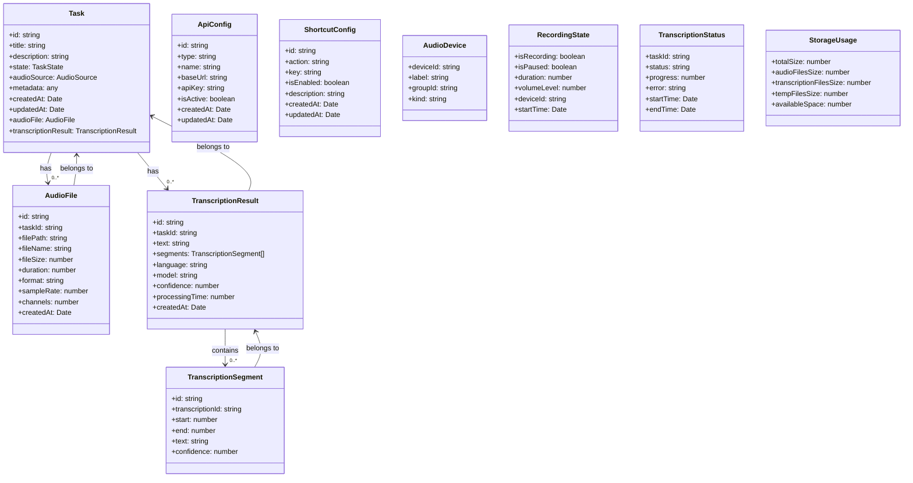
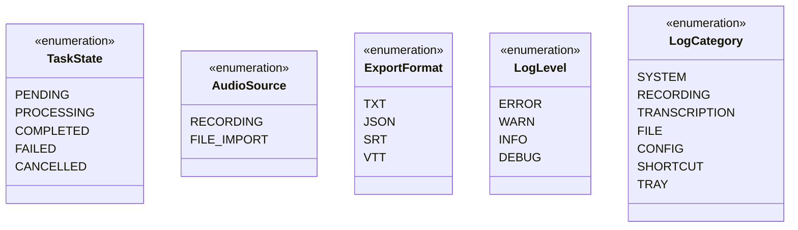

# WhisperElectron 技术设计文档

## 概述

本文档详细描述了WhisperElectron项目的技术实现方案，包括架构设计、模块划分、接口定义等具体技术细节。

## 技术架构

### 整体架构

```
┌─────────────────┐    ┌─────────────────┐    ┌─────────────────┐
│   渲染进程      │    │   主进程        │    │   系统服务      │
│   (React)       │◄──►│   (Electron)    │◄──►│   (Node.js)     │
└─────────────────┘    └─────────────────┘    └─────────────────┘
         │                       │                       │
         ▼                       ▼                       ▼
┌─────────────────┐    ┌─────────────────┐    ┌─────────────────┐
│   用户界面      │    │   业务逻辑      │    │   数据存储      │
│   (TypeScript)  │    │   (TypeScript)  │    │   (SQLite)      │
└─────────────────┘    └─────────────────┘    └─────────────────┘
```

### 技术栈

- **前端**: React 18+ + TypeScript + Tailwind CSS
- **后端**: Electron + Node.js + TypeScript
- **数据库**: SQLite
- **构建工具**: Vite
- **日志**: Winston

## 核心模块设计

### 1. 配置管理模块

#### 1.1 配置管理器接口

```typescript
interface ConfigManager {
  // 获取指定分类的配置，如果提供key则返回特定配置项
  getConfig(category: string, key?: string): any;
  
  // 设置指定分类和键的配置值
  setConfig(category: string, key: string, value: any): Promise<void>;
  
  // 获取指定类型的API配置
  getApiConfig(apiType: string): Promise<ApiConfig | null>;
  
  // 获取所有快捷键配置
  getShortcuts(): Promise<ShortcutConfig[]>;
  
  // 更新快捷键配置
  updateShortcut(action: string, key: string, isEnabled: boolean): Promise<void>;
  
  // 验证配置有效性
  validateConfig(category: string, config: any): boolean;
}
```

#### 1.2 配置管理器实现

```typescript
class ConfigManagerImpl implements ConfigManager {
  // 初始化配置管理器，加载默认配置
  // - 检查数据库连接状态
  // - 创建配置表（如果不存在）
  // - 加载默认配置到数据库
  // - 验证配置完整性
  // - 初始化配置缓存
  
  // 获取配置的具体实现
  // - 根据category查询app_config表
  // - 如果指定了key，返回特定配置项
  // - 否则返回该分类下的所有配置
  // - 处理配置值的类型转换（字符串转数字、布尔值等）
  // - 返回配置值或默认值
  
  // 设置配置的具体实现
  // - 验证配置值的有效性
  // - 检查是否为系统配置（只读）
  // - 更新或插入配置项到数据库
  // - 更新配置缓存
  // - 触发配置变更事件
  // - 记录配置变更日志
  
  // 获取API配置的具体实现
  // - 查询api_config表
  // - 过滤活跃的API配置
  // - 返回匹配的API配置（包含认证信息）
  // - 处理API配置的加密/解密
  
  // 获取快捷键配置的具体实现
  // - 查询shortcut_config表
  // - 返回所有快捷键配置
  // - 按action排序
  // - 包含启用/禁用状态
  
  // 更新快捷键配置的具体实现
  // - 验证快捷键格式
  // - 检查快捷键冲突
  // - 更新数据库记录
  // - 重新注册系统快捷键
  // - 记录操作日志
  
  // 验证配置有效性的具体实现
  // - 根据category定义验证规则
  // - 检查必填字段
  // - 验证数据类型和范围
  // - 返回验证结果
  // - 提供详细的错误信息
}
```

### 2. 任务管理模块

#### 2.1 任务管理器接口

```typescript
interface TaskManager {
  // 创建新任务
  createTask(audioSource: AudioSource, metadata?: any): Promise<Task>;
  
  // 获取任务列表
  getTasks(filters?: TaskFilters): Promise<Task[]>;
  
  // 获取单个任务详情
  getTask(taskId: string): Promise<Task | null>;
  
  // 更新任务信息
  updateTask(taskId: string, updates: Partial<Task>): Promise<void>;
  
  // 删除任务
  deleteTask(taskId: string): Promise<void>;
  
  // 更新任务状态
  updateTaskState(taskId: string, state: TaskState): Promise<void>;
  
  // 搜索任务
  searchTasks(query: string): Promise<Task[]>;
}
```

#### 2.2 任务管理器实现

```typescript
class TaskManagerImpl implements TaskManager {
  // 初始化任务管理器
  // - 初始化数据库连接
  // - 创建任务相关表（如果不存在）
  // - 设置任务状态监听器
  // - 初始化任务队列
  
  // 创建任务的具体实现
  // - 生成唯一任务ID（UUID）
  // - 创建任务记录到数据库
  // - 设置初始状态为PENDING
  // - 保存音频源信息和元数据
  // - 记录创建日志
  // - 返回创建的任务对象
  
  // 获取任务列表的具体实现
  // - 构建查询条件（状态、时间范围、标签等）
  // - 执行数据库查询（JOIN关联）
  // - 关联音频文件和转录结果信息
  // - 按创建时间倒序排列
  // - 支持分页查询
  // - 返回任务列表
  
  // 获取任务详情的具体实现
  // - 查询任务基本信息
  // - 关联音频文件详细信息
  // - 关联转录结果和文件信息
  // - 返回完整的任务信息对象
  
  // 更新任务的具体实现
  // - 验证任务是否存在
  // - 检查字段更新权限（防止修改只读字段）
  // - 更新数据库记录
  // - 记录更新日志
  // - 触发任务更新事件
  // - 通知UI更新
  
  // 删除任务的具体实现
  // - 验证任务状态（防止删除进行中的任务）
  // - 删除关联的音频文件
  // - 删除关联的转录文件
  // - 删除数据库记录
  // - 记录删除日志
  // - 清理相关资源
  
  // 更新任务状态的具体实现
  // - 验证状态转换的合法性
  // - 更新任务状态到数据库
  // - 记录状态变更日志
  // - 触发状态变更事件
  // - 通知UI更新
  // - 处理状态相关的业务逻辑
  
  // 搜索任务的具体实现
  // - 构建搜索条件（标题、描述、标签、内容）
  // - 执行模糊查询（LIKE或全文搜索）
  // - 支持多字段组合搜索
  // - 返回匹配的任务列表
  // - 支持搜索结果高亮
}
```

### 3. 音频录制模块

#### 3.1 录音管理器接口

```typescript
interface AudioRecorder {
  // 开始录音
  startRecording(options?: RecordingOptions): Promise<void>;
  
  // 停止录音
  stopRecording(): Promise<AudioFile>;
  
  // 暂停录音
  pauseRecording(): Promise<void>;
  
  // 恢复录音
  resumeRecording(): Promise<void>;
  
  // 取消录音
  cancelRecording(): Promise<void>;
  
  // 获取录音状态
  getRecordingState(): RecordingState;
  
  // 获取实时音量
  getVolumeLevel(): number;
  
  // 获取录音时长
  getRecordingDuration(): number;
  
  // 设置录音设备
  setRecordingDevice(deviceId: string): Promise<void>;
  
  // 获取可用录音设备
  getAvailableDevices(): Promise<AudioDevice[]>;
}
```

#### 3.2 录音管理器实现

```typescript
class AudioRecorderImpl implements AudioRecorder {
  // 初始化录音管理器
  // - 初始化Web Audio API上下文
  // - 设置音频分析器节点
  // - 配置默认录音参数
  // - 初始化设备管理器
  
  // 开始录音的具体实现
  // - 检查麦克风权限
  // - 获取用户媒体流（getUserMedia）
  // - 创建MediaRecorder实例
  // - 配置录音参数（采样率、声道、格式）
  // - 开始音频数据采集
  // - 实时处理音频数据（音量分析）
  // - 更新录音状态
  // - 记录开始录音日志
  
  // 停止录音的具体实现
  // - 停止MediaRecorder
  // - 保存录音文件到本地
  // - 生成音频文件元数据
  // - 更新录音状态
  // - 记录停止录音日志
  // - 返回音频文件信息
  
  // 暂停录音的具体实现
  // - 暂停MediaRecorder
  // - 保持音频流连接
  // - 更新录音状态
  // - 记录暂停日志
  
  // 恢复录音的具体实现
  // - 恢复MediaRecorder
  // - 更新录音状态
  // - 记录恢复日志
  
  // 取消录音的具体实现
  // - 停止MediaRecorder
  // - 删除临时文件
  // - 重置录音状态
  // - 记录取消日志
  
  // 获取录音状态的具体实现
  // - 返回当前录音状态
  // - 包含录音时长、音量等信息
  
  // 获取实时音量的具体实现
  // - 通过AnalyserNode计算音频数据音量
  // - 返回0-100的音量值
  
  // 获取录音时长的具体实现
  // - 计算从开始录音到现在的时长
  // - 返回秒数
  
  // 设置录音设备的具体实现
  // - 验证设备ID有效性
  // - 停止当前录音（如果正在录音）
  // - 重新获取用户媒体流
  // - 更新录音设备
  // - 记录设备切换日志
  
  // 获取可用录音设备的具体实现
  // - 调用navigator.mediaDevices.enumerateDevices()
  // - 过滤音频输入设备
  // - 返回设备列表
}
```

### 4. 转录处理模块

#### 4.1 API抽象接口

```typescript
// 转录API抽象接口，支持不同API提供商的统一调用
interface TranscriptionAPI {
  // 执行音频转录
  transcribe(audioFile: string, options: TranscriptionOptions): Promise<TranscriptionResult>;
  
  // 获取支持的模型列表
  getModels(): Promise<string[]>;
  
  // 测试API连接
  testConnection(): Promise<boolean>;
}
```

#### 4.2 OpenAI Whisper API实现

```typescript
// OpenAI Whisper API的具体实现
class OpenAIWhisperAPI implements TranscriptionAPI {
  // 初始化OpenAI API客户端
  // - 配置API密钥和基础URL
  // - 设置请求超时和重试策略
  // - 初始化HTTP客户端
  
  // 执行转录操作
  // - 构建multipart/form-data请求
  // - 发送音频文件到OpenAI API
  // - 处理API响应和错误
  // - 解析转录结果
  
  // 获取可用模型
  // - 调用OpenAI模型列表API
  // - 过滤Whisper相关模型
  // - 返回模型名称列表
  
  // 测试API连接
  // - 发送简单的测试请求
  // - 验证API密钥有效性
  // - 检查网络连接状态
}
```

#### 4.3 自定义API实现

```typescript
// 自定义Whisper API的具体实现
class CustomWhisperAPI implements TranscriptionAPI {
  // 初始化自定义API客户端
  // - 配置自定义API地址和认证信息
  // - 设置请求格式和参数映射
  // - 初始化HTTP客户端
  
  // 执行转录操作
  // - 根据自定义API格式构建请求
  // - 发送音频数据（Base64或文件上传）
  // - 处理自定义API响应格式
  // - 解析转录结果
  
  // 获取可用模型
  // - 调用自定义API的模型接口
  // - 解析模型列表响应
  // - 返回支持的模型名称
  
  // 测试API连接
  // - 发送连接测试请求
  // - 验证API服务可用性
  // - 检查认证信息有效性
}
```

#### 4.4 转录管理器接口

```typescript
interface TranscriptionManager {
  // 开始转录
  startTranscription(taskId: string, options?: TranscriptionOptions): Promise<void>;
  
  // 停止转录
  stopTranscription(taskId: string): Promise<void>;
  
  // 获取转录状态
  getTranscriptionStatus(taskId: string): TranscriptionStatus;
  
  // 获取转录进度
  getTranscriptionProgress(taskId: string): number;
  
  // 获取转录结果
  getTranscriptionResult(taskId: string): Promise<TranscriptionResult>;
  
  // 导出转录结果
  exportTranscription(taskId: string, format: ExportFormat): Promise<string>;
  
  // 批量转录
  batchTranscribe(taskIds: string[]): Promise<void>;
}
```

#### 4.5 转录管理器实现

```typescript
class TranscriptionManagerImpl implements TranscriptionManager {
  // 初始化转录管理器
  // - 根据配置创建对应的API客户端
  // - 初始化格式转换器
  // - 设置重试和错误处理策略
  
  // 开始转录的具体实现
  // - 验证任务状态和音频文件
  // - 预处理音频文件（格式转换、压缩等）
  // - 调用对应的API客户端执行转录
  // - 处理API响应和错误
  // - 保存转录结果到数据库和文件系统
  // - 更新任务状态和进度
  // - 记录转录日志
  
  // 停止转录的具体实现
  // - 检查转录状态
  // - 取消正在进行的API请求
  // - 清理临时资源
  // - 更新任务状态
  // - 记录停止日志
  
  // 获取转录状态的具体实现
  // - 查询任务状态
  // - 返回转录状态信息
  
  // 获取转录进度的具体实现
  // - 计算转录进度百分比
  // - 返回0-100的进度值
  
  // 获取转录结果的具体实现
  // - 查询转录结果
  // - 读取转录文件
  // - 返回完整结果
  
  // 导出转录结果的具体实现
  // - 获取转录结果
  // - 转换为指定格式（TXT、JSON、SRT、VTT）
  // - 生成导出文件
  // - 返回文件路径
  
  // 批量转录的具体实现
  // - 验证任务列表
  // - 创建转录队列
  // - 逐个处理转录任务
  // - 处理错误和重试
  // - 记录批量处理日志
  
  // 创建API客户端
  // - 根据API配置类型创建对应的客户端
  // - 支持OpenAI和自定义API类型
  // - 返回统一的API接口实例
}
```

### 5. 文件管理模块

#### 5.1 文件管理器接口

```typescript
interface FileManager {
  // 导入音频文件
  importAudioFiles(filePaths: string[]): Promise<AudioFile[]>;
  
  // 验证音频文件
  validateAudioFile(filePath: string): Promise<boolean>;
  
  // 获取音频文件信息
  getAudioFileInfo(filePath: string): Promise<AudioFileInfo>;
  
  // 复制音频文件
  copyAudioFile(sourcePath: string, taskId: string): Promise<string>;
  
  // 删除音频文件
  deleteAudioFile(filePath: string): Promise<void>;
  
  // 获取存储空间使用情况
  getStorageUsage(): Promise<StorageUsage>;
  
  // 清理临时文件
  cleanupTempFiles(): Promise<void>;
}
```

#### 5.2 文件管理器实现

```typescript
class FileManagerImpl implements FileManager {
  // 初始化文件管理器
  // - 创建应用目录结构
  // - 初始化文件监控
  // - 设置文件清理策略
  // - 初始化音频格式支持
  
  // 导入音频文件的具体实现
  // - 验证文件路径和权限
  // - 检查文件格式（MP3、WAV、M4A、FLAC等）
  // - 复制文件到应用目录
  // - 生成文件元数据（时长、大小、格式等）
  // - 返回音频文件信息
  // - 处理重复文件检测
  
  // 验证音频文件的具体实现
  // - 检查文件是否存在和可读
  // - 验证文件格式（通过文件头或扩展名）
  // - 检查文件大小限制
  // - 验证音频完整性（通过FFmpeg）
  // - 返回验证结果和错误信息
  
  // 获取音频文件信息的具体实现
  // - 使用FFmpeg读取文件元数据
  // - 获取音频时长、采样率、声道数
  // - 获取文件大小和创建时间
  // - 返回完整的音频信息对象
  
  // 复制音频文件的具体实现
  // - 生成唯一的目标路径
  // - 复制文件到目标位置
  // - 验证复制结果（文件完整性）
  // - 返回目标文件路径
  // - 处理复制过程中的错误
  
  // 删除音频文件的具体实现
  // - 检查文件是否存在
  // - 验证文件权限
  // - 删除文件
  // - 记录删除日志
  // - 清理相关元数据
  
  // 获取存储空间使用情况的具体实现
  // - 计算应用目录总大小
  // - 统计各类文件大小（音频、转录、临时等）
  // - 计算可用空间
  // - 返回详细的使用情况报告
  
  // 清理临时文件的具体实现
  // - 扫描临时目录
  // - 识别过期文件（基于时间戳）
  // - 删除过期文件
  // - 记录清理日志
  // - 返回清理统计信息
  
  // 音频格式转换
  // - 使用FFmpeg进行格式转换
  // - 支持压缩和优化
  // - 处理转换过程中的错误
  // - 返回转换后的文件路径
}
```

### 6. 系统集成模块

#### 6.1 快捷键管理器接口

```typescript
interface ShortcutManager {
  // 注册快捷键
  registerShortcut(action: string, key: string): Promise<void>;
  
  // 注销快捷键
  unregisterShortcut(action: string): Promise<void>;
  
  // 更新快捷键
  updateShortcut(action: string, key: string): Promise<void>;
  
  // 检查快捷键冲突
  checkShortcutConflict(key: string): Promise<boolean>;
  
  // 获取所有快捷键
  getAllShortcuts(): Promise<ShortcutConfig[]>;
  
  // 启用/禁用快捷键
  toggleShortcut(action: string, enabled: boolean): Promise<void>;
}
```

#### 6.2 快捷键管理器实现

```typescript
class ShortcutManagerImpl implements ShortcutManager {
  // 初始化快捷键管理器
  // - 初始化Electron globalShortcut
  // - 加载已注册的快捷键配置
  // - 设置快捷键冲突检测
  // - 初始化事件处理器
  
  // 注册快捷键的具体实现
  // - 验证快捷键格式（支持组合键）
  // - 检查快捷键冲突（系统级和应用级）
  // - 使用globalShortcut.register注册系统快捷键
  // - 保存快捷键配置到数据库
  // - 绑定快捷键动作处理函数
  // - 记录注册日志
  
  // 注销快捷键的具体实现
  // - 使用globalShortcut.unregister注销系统快捷键
  // - 更新数据库中的快捷键状态
  // - 清理事件监听器
  // - 记录注销日志
  
  // 更新快捷键的具体实现
  // - 注销旧的系统快捷键
  // - 注册新的系统快捷键
  // - 更新数据库配置
  // - 重新绑定动作处理函数
  // - 记录更新日志
  
  // 检查快捷键冲突的具体实现
  // - 查询已注册的快捷键列表
  // - 检查是否与系统快捷键冲突
  // - 检查是否与应用内快捷键冲突
  // - 返回冲突状态和详细信息
  
  // 获取所有快捷键的具体实现
  // - 查询数据库中的快捷键配置
  // - 返回快捷键列表（包含状态信息）
  
  // 启用/禁用快捷键的具体实现
  // - 更新数据库中的启用状态
  // - 根据状态注册或注销系统快捷键
  // - 记录状态变更日志
  
  // 快捷键动作处理
  // - 根据action类型执行相应操作
  // - 支持录音开始/停止、应用显示/隐藏等
  // - 处理快捷键触发的业务逻辑
}
```

#### 6.3 系统托盘管理器接口

```typescript
interface TrayManager {
  // 初始化系统托盘
  initialize(): Promise<void>;
  
  // 更新托盘图标
  updateIcon(iconPath: string): Promise<void>;
  
  // 更新托盘菜单
  updateMenu(menuItems: MenuItem[]): Promise<void>;
  
  // 显示托盘通知
  showNotification(title: string, message: string): Promise<void>;
  
  // 设置托盘工具提示
  setTooltip(tooltip: string): Promise<void>;
  
  // 销毁系统托盘
  destroy(): Promise<void>;
}
```

#### 6.4 系统托盘管理器实现

```typescript
class TrayManagerImpl implements TrayManager {
  // 初始化系统托盘的具体实现
  // - 创建Electron Tray实例
  // - 加载托盘图标文件
  // - 设置默认工具提示
  // - 创建默认托盘菜单
  // - 绑定托盘事件（点击、右键等）
  // - 记录初始化日志
  
  // 更新托盘图标的具体实现
  // - 验证图标文件路径和格式
  // - 使用nativeImage.createFromPath加载图标
  // - 调用tray.setImage更新图标
  // - 记录更新日志
  
  // 更新托盘菜单的具体实现
  // - 构建菜单项结构
  // - 使用Menu.buildFromTemplate创建菜单
  // - 绑定菜单项点击事件
  // - 调用tray.setContextMenu更新菜单
  // - 处理菜单项状态（启用/禁用）
  
  // 显示托盘通知的具体实现
  // - 检查系统通知权限
  // - 创建Notification实例
  // - 设置通知标题、内容和图标
  // - 显示系统通知
  // - 处理通知点击事件
  // - 记录通知日志
  
  // 设置托盘工具提示的具体实现
  // - 调用tray.setTooltip更新工具提示
  // - 支持动态工具提示（如显示录音状态）
  
  // 销毁系统托盘的具体实现
  // - 清理事件监听器
  // - 销毁托盘实例
  // - 清理相关资源
  // - 记录销毁日志
  
  // 状态指示功能
  // - 根据应用状态更新图标颜色
  // - 更新工具提示显示状态信息
  // - 处理录音状态的视觉反馈
  
  // 托盘菜单项管理
  // - 动态添加/移除菜单项
  // - 处理菜单项权限控制
  // - 支持子菜单和分隔符
}
```

## 数据库设计

### 数据库初始化

```typescript
class DatabaseManager {
  // 初始化数据库
  async initialize(): Promise<void> {
    // 创建数据库连接
    // 执行建表脚本
    // 创建索引
    // 插入默认数据
    // 验证数据库完整性
  }
  
  // 执行建表脚本
  async createTables(): Promise<void> {
    // 创建task表
    // 创建audio_file表
    // 创建transcription_result表
    // 创建transcription_file表
    // 创建app_config表
    // 创建api_config表
    // 创建shortcut_config表
  }
  
  // 创建索引
  async createIndexes(): Promise<void> {
    // 为task表创建索引
    // 为audio_file表创建索引
    // 为transcription_result表创建索引
    // 为配置表创建索引
  }
  
  // 插入默认数据
  async insertDefaultData(): Promise<void> {
    // 插入默认配置
    // 插入默认快捷键
    // 插入默认API配置
  }
}
```

### 数据库迁移

```typescript
class DatabaseMigration {
  // 执行数据库迁移
  async migrate(): Promise<void> {
    // 检查当前版本
    // 执行迁移脚本
    // 更新版本号
    // 记录迁移日志
  }
  
  // 备份数据库
  async backup(): Promise<string> {
    // 创建备份文件
    // 复制数据库文件
    // 返回备份路径
  }
  
  // 恢复数据库
  async restore(backupPath: string): Promise<void> {
    // 验证备份文件
    // 停止数据库连接
    // 恢复数据库文件
    // 重新连接数据库
  }
}
```

## 日志系统

### 日志管理器

```typescript
class LogManager {
  // 初始化日志系统
  async initialize(): Promise<void> {
    // 配置日志格式
    // 设置日志级别
    // 创建日志目录
    // 配置日志轮转
  }
  
  // 记录系统日志
  log(level: LogLevel, category: LogCategory, message: string, metadata?: any): void {
    // 格式化日志消息
    // 添加时间戳
    // 写入日志文件
    // 控制台输出（开发环境）
  }
  
  // 记录错误日志
  error(category: LogCategory, message: string, error?: Error, metadata?: any): void {
    // 记录错误信息
    // 记录错误堆栈
    // 记录相关元数据
  }
  
  // 清理过期日志
  async cleanupOldLogs(): Promise<void> {
    // 扫描日志目录
    // 删除过期日志文件
    // 压缩归档日志
  }
}
```

## 错误处理

### 错误处理策略

```typescript
class ErrorHandler {
  // 处理应用错误
  handleError(error: Error, context?: string): void {
    // 记录错误日志
    // 显示用户友好的错误信息
    // 执行错误恢复操作
    // 发送错误报告（可选）
  }
  
  // 处理API错误
  handleApiError(error: any, apiType: string): void {
    // 解析API错误信息
    // 执行重试逻辑
    // 降级处理
    // 通知用户
  }
  
  // 处理文件操作错误
  handleFileError(error: Error, operation: string, filePath: string): void {
    // 检查文件权限
    // 检查磁盘空间
    // 提供解决方案
    // 记录错误详情
  }
}
```

## 性能优化

### 性能监控

```typescript
class PerformanceMonitor {
  // 监控内存使用
  monitorMemoryUsage(): void {
    // 定期检查内存使用
    // 记录内存使用趋势
    // 触发内存清理
  }
  
  // 监控CPU使用
  monitorCpuUsage(): void {
    // 监控CPU使用率
    // 优化高CPU操作
    // 记录性能数据
  }
  
  // 监控响应时间
  monitorResponseTime(operation: string): void {
    // 记录操作开始时间
    // 记录操作结束时间
    // 计算响应时间
    // 记录性能指标
  }
}
```

## 安全考虑

### 安全措施

```typescript
class SecurityManager {
  // 验证API密钥
  validateApiKey(apiKey: string): boolean {
    // 检查API密钥格式
    // 验证密钥有效性
    // 返回验证结果
  }
  
  // 加密敏感数据
  encryptSensitiveData(data: string): string {
    // 使用加密算法
    // 加密敏感数据
    // 返回加密结果
  }
  
  // 解密敏感数据
  decryptSensitiveData(encryptedData: string): string {
    // 使用解密算法
    // 解密数据
    // 返回解密结果
  }
  
  // 清理敏感信息
  sanitizeLogData(data: any): any {
    // 移除敏感字段
    // 脱敏处理
    // 返回清理后的数据
  }
}
```

## 测试策略

### 单元测试

```typescript
// 配置管理器测试
describe('ConfigManager', () => {
  // 测试配置获取
  test('should get config correctly', async () => {
    // 准备测试数据
    // 执行测试
    // 验证结果
  });
  
  // 测试配置设置
  test('should set config correctly', async () => {
    // 准备测试数据
    // 执行测试
    // 验证结果
  });
});

// 任务管理器测试
describe('TaskManager', () => {
  // 测试任务创建
  test('should create task correctly', async () => {
    // 准备测试数据
    // 执行测试
    // 验证结果
  });
  
  // 测试任务状态更新
  test('should update task state correctly', async () => {
    // 准备测试数据
    // 执行测试
    // 验证结果
  });
});
```

### 集成测试

```typescript
// 录音到转录流程测试
describe('Recording to Transcription Flow', () => {
  test('should complete full workflow', async () => {
    // 开始录音
    // 停止录音
    // 创建任务
    // 开始转录
    // 验证结果
  });
});
```

### 端到端测试

```typescript
// 用户界面测试
describe('User Interface', () => {
  test('should handle user interactions', async () => {
    // 模拟用户操作
    // 验证界面响应
    // 验证数据更新
  });
});
```

## 部署和发布

### 构建配置

```typescript
// 开发环境构建
const devBuild = {
  // 启用热重载
  // 启用调试模式
  // 配置开发服务器
  // 设置环境变量
};

// 生产环境构建
const prodBuild = {
  // 代码压缩
  // 资源优化
  // 安全配置
  // 性能优化
};
```

### 打包配置

```typescript
// Electron打包配置
const electronBuilder = {
  // 应用信息
  // 图标设置
  // 权限配置
  // 自动更新
  // 代码签名
};
```

## 类图设计

### 核心模块类图

```mermaid
classDiagram
    %% 配置管理模块
    class ConfigManager {
        <<interface>>
        +getConfig(category, key?) any
        +setConfig(category, key, value) Promise~void~
        +getApiConfig(apiType) Promise~ApiConfig~
        +getShortcuts() Promise~ShortcutConfig[]~
        +updateShortcut(action, key, enabled) Promise~void~
        +validateConfig(category, config) boolean
    }
    
    class ConfigManagerImpl {
        -db: Database
        -cache: Map
        +initialize() Promise~void~
        +getConfig(category, key?) Promise~any~
        +setConfig(category, key, value) Promise~void~
        +getApiConfig(apiType) Promise~ApiConfig~
        +getShortcuts() Promise~ShortcutConfig[]~
        +updateShortcut(action, key, enabled) Promise~void~
        +validateConfig(category, config) boolean
    }
    
    %% 任务管理模块
    class TaskManager {
        <<interface>>
        +createTask(audioSource, metadata?) Promise~Task~
        +getTasks(filters?) Promise~Task[]~
        +getTask(taskId) Promise~Task~
        +updateTask(taskId, updates) Promise~void~
        +deleteTask(taskId) Promise~void~
        +updateTaskState(taskId, state) Promise~void~
        +searchTasks(query) Promise~Task[]~
    }
    
    class TaskManagerImpl {
        -db: Database
        -eventEmitter: EventEmitter
        +initialize() Promise~void~
        +createTask(audioSource, metadata?) Promise~Task~
        +getTasks(filters?) Promise~Task[]~
        +getTask(taskId) Promise~Task~
        +updateTask(taskId, updates) Promise~void~
        +deleteTask(taskId) Promise~void~
        +updateTaskState(taskId, state) Promise~void~
        +searchTasks(query) Promise~Task[]~
    }
    
    %% 音频录制模块
    class AudioRecorder {
        <<interface>>
        +startRecording(options?) Promise~void~
        +stopRecording() Promise~AudioFile~
        +pauseRecording() Promise~void~
        +resumeRecording() Promise~void~
        +cancelRecording() Promise~void~
        +getRecordingState() RecordingState
        +getVolumeLevel() number
        +getRecordingDuration() number
        +setRecordingDevice(deviceId) Promise~void~
        +getAvailableDevices() Promise~AudioDevice[]~
    }
    
    class AudioRecorderImpl {
        -audioContext: AudioContext
        -mediaRecorder: MediaRecorder
        -analyser: AnalyserNode
        -stream: MediaStream
        -recordingState: RecordingState
        +initialize() Promise~void~
        +startRecording(options?) Promise~void~
        +stopRecording() Promise~AudioFile~
        +pauseRecording() Promise~void~
        +resumeRecording() Promise~void~
        +cancelRecording() Promise~void~
        +getRecordingState() RecordingState
        +getVolumeLevel() number
        +getRecordingDuration() number
        +setRecordingDevice(deviceId) Promise~void~
        +getAvailableDevices() Promise~AudioDevice[]~
    }
    
    %% 转录处理模块
    class TranscriptionAPI {
        <<interface>>
        +transcribe(audioFile, options) Promise~TranscriptionResult~
        +getModels() Promise~string[]~
        +testConnection() Promise~boolean~
    }
    
    class OpenAIWhisperAPI {
        -client: AxiosInstance
        -config: ApiConfig
        +transcribe(audioFile, options) Promise~TranscriptionResult~
        +getModels() Promise~string[]~
        +testConnection() Promise~boolean~
    }
    
    class CustomWhisperAPI {
        -client: AxiosInstance
        -config: ApiConfig
        +transcribe(audioFile, options) Promise~TranscriptionResult~
        +getModels() Promise~string[]~
        +testConnection() Promise~boolean~
    }
    
    class TranscriptionManager {
        <<interface>>
        +startTranscription(taskId, options?) Promise~void~
        +stopTranscription(taskId) Promise~void~
        +getTranscriptionStatus(taskId) TranscriptionStatus
        +getTranscriptionProgress(taskId) number
        +getTranscriptionResult(taskId) Promise~TranscriptionResult~
        +exportTranscription(taskId, format) Promise~string~
        +batchTranscribe(taskIds) Promise~void~
    }
    
    class TranscriptionManagerImpl {
        -apiClient: TranscriptionAPI
        -formatConverter: FormatConverter
        -retryStrategy: RetryStrategy
        +initialize() Promise~void~
        +startTranscription(taskId, options?) Promise~void~
        +stopTranscription(taskId) Promise~void~
        +getTranscriptionStatus(taskId) TranscriptionStatus
        +getTranscriptionProgress(taskId) number
        +getTranscriptionResult(taskId) Promise~TranscriptionResult~
        +exportTranscription(taskId, format) Promise~string~
        +batchTranscribe(taskIds) Promise~void~
        -createAPIClient(config) TranscriptionAPI
    }
    
    %% 文件管理模块
    class FileManager {
        <<interface>>
        +importAudioFiles(filePaths) Promise~AudioFile[]~
        +validateAudioFile(filePath) Promise~boolean~
        +getAudioFileInfo(filePath) Promise~AudioFileInfo~
        +copyAudioFile(sourcePath, taskId) Promise~string~
        +deleteAudioFile(filePath) Promise~void~
        +getStorageUsage() Promise~StorageUsage~
        +cleanupTempFiles() Promise~void~
    }
    
    class FileManagerImpl {
        -appDir: string
        -tempDir: string
        -audioDir: string
        +initialize() Promise~void~
        +importAudioFiles(filePaths) Promise~AudioFile[]~
        +validateAudioFile(filePath) Promise~boolean~
        +getAudioFileInfo(filePath) Promise~AudioFileInfo~
        +copyAudioFile(sourcePath, taskId) Promise~string~
        +deleteAudioFile(filePath) Promise~void~
        +getStorageUsage() Promise~StorageUsage~
        +cleanupTempFiles() Promise~void~
        +convertAudioFormat(sourcePath, targetFormat) Promise~string~
    }
    
    %% 系统集成模块
    class ShortcutManager {
        <<interface>>
        +registerShortcut(action, key) Promise~void~
        +unregisterShortcut(action) Promise~void~
        +updateShortcut(action, key) Promise~void~
        +checkShortcutConflict(key) Promise~boolean~
        +getAllShortcuts() Promise~ShortcutConfig[]~
        +toggleShortcut(action, enabled) Promise~void~
    }
    
    class ShortcutManagerImpl {
        -globalShortcut: GlobalShortcut
        -registeredShortcuts: Map
        +initialize() Promise~void~
        +registerShortcut(action, key) Promise~void~
        +unregisterShortcut(action) Promise~void~
        +updateShortcut(action, key) Promise~void~
        +checkShortcutConflict(key) Promise~boolean~
        +getAllShortcuts() Promise~ShortcutConfig[]~
        +toggleShortcut(action, enabled) Promise~void~
        -handleShortcutAction(action) void
    }
    
    class TrayManager {
        <<interface>>
        +initialize() Promise~void~
        +updateIcon(iconPath) Promise~void~
        +updateMenu(menuItems) Promise~void~
        +showNotification(title, message) Promise~void~
        +setTooltip(tooltip) Promise~void~
        +destroy() Promise~void~
    }
    
    class TrayManagerImpl {
        -tray: Tray
        -menu: Menu
        -iconPath: string
        +initialize() Promise~void~
        +updateIcon(iconPath) Promise~void~
        +updateMenu(menuItems) Promise~void~
        +showNotification(title, message) Promise~void~
        +setTooltip(tooltip) Promise~void~
        +destroy() Promise~void~
        +updateStatusIndicator(status) void
        +manageMenuItems() void
    }
    
    %% 关系定义
    ConfigManagerImpl ..|> ConfigManager
    TaskManagerImpl ..|> TaskManager
    AudioRecorderImpl ..|> AudioRecorder
    OpenAIWhisperAPI ..|> TranscriptionAPI
    CustomWhisperAPI ..|> TranscriptionAPI
    TranscriptionManagerImpl ..|> TranscriptionManager
    FileManagerImpl ..|> FileManager
    ShortcutManagerImpl ..|> ShortcutManager
    TrayManagerImpl ..|> TrayManager
    
    %% 依赖关系
    TranscriptionManagerImpl --> TranscriptionAPI : uses
    TranscriptionManagerImpl --> OpenAIWhisperAPI : creates
    TranscriptionManagerImpl --> CustomWhisperAPI : creates
    TaskManagerImpl --> ConfigManager : uses
    AudioRecorderImpl --> FileManager : uses
    ShortcutManagerImpl --> ConfigManager : uses
    TrayManagerImpl --> TaskManager : uses
```



### 数据模型类图



### 枚举类型定义



## 总结

本文档详细描述了WhisperElectron项目的技术实现方案，包括：

1. **模块化设计**: 清晰的模块划分和接口定义
2. **可扩展性**: 易于添加新功能和修改现有功能
3. **可维护性**: 良好的代码结构和错误处理
4. **性能优化**: 内存和CPU使用监控
5. **安全考虑**: 敏感数据保护和验证
6. **测试策略**: 完整的测试覆盖

通过这种设计，可以确保项目的稳定性、可维护性和可扩展性。
